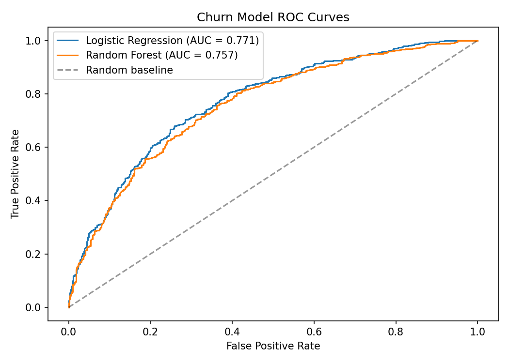
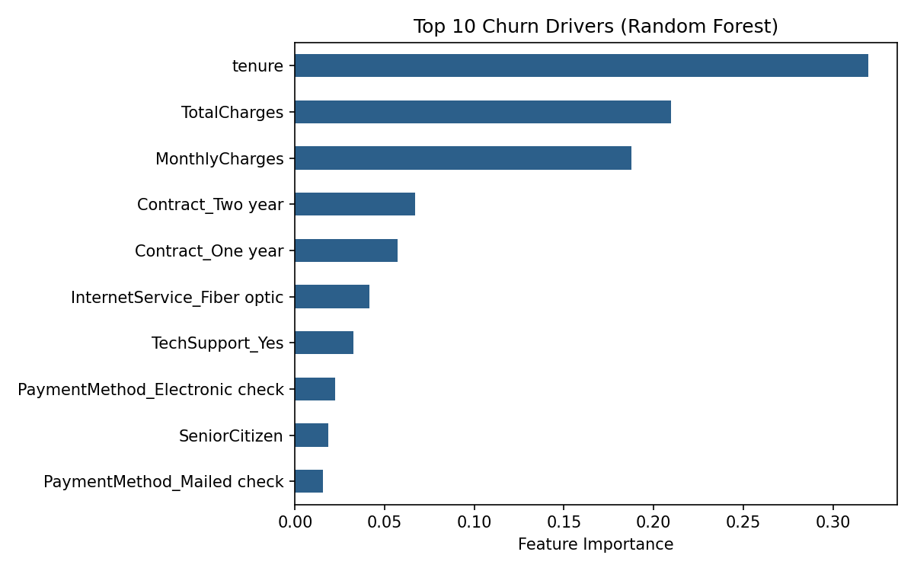

# Telco Customer Churn Propensity Model

Predicts which customers are most likely to churn, using **logistic regression** and **random forest** classifiers, and translates model outputs into plain-English audience segment insights for non-technical stakeholders.



## What it does
- Trains and compares two classifiers on customer attributes (tenure, contract type, charges, services)
- Evaluates with **ROC-AUC** and full classification reports
- Identifies the top churn drivers via feature importance
- Produces stakeholder-ready segment insights (e.g. *"customers in their first 6 months churn at 3x the rate of long-tenured customers"*)

## Key result
Random forest achieves the strongest discrimination, with **contract type, tenure, and monthly charges** emerging as the dominant churn drivers — pointing retention budgets toward new, month-to-month customers.



## How to run
```bash
pip install pandas numpy scikit-learn matplotlib
python churn_model.py                 # runs on bundled synthetic data
python churn_model.py telco.csv       # or on the Kaggle Telco dataset
```
The script generates realistic synthetic data by default, so it runs with no downloads. To use real data, download the [Kaggle Telco Customer Churn dataset](https://www.kaggle.com/datasets/blastchar/telco-customer-churn) and pass the CSV path.

## Skills demonstrated
Python · pandas · scikit-learn · predictive modelling · model evaluation · stakeholder communication
